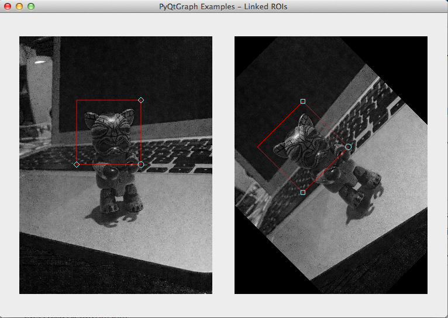

# PyQtGraph Examples

This small repository contains a few _(well, right now, only one, but I'll add
more if I find other useful things)_ examples of what I found useful after
having used the [PyQtGraph](http://www.pyqtgraph.org) library.

They are self-contained and heavily commented, and will hopefully constitute a
good example of some advanced uses of PyQtGraph.

## Linked ROIs

This example needs the OpenCV python bindings and NumPy installed.

It features a window showing two images side by side, and one rectangular ROI
selector per image. The two image are related via a (known) perspective
transformation.

Both ROIs are linked, i.e. if the user moves the region in the first image, the
region in the second image is automatically updated to show the same contents
as the first region.

